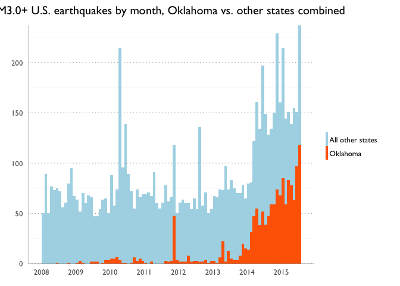
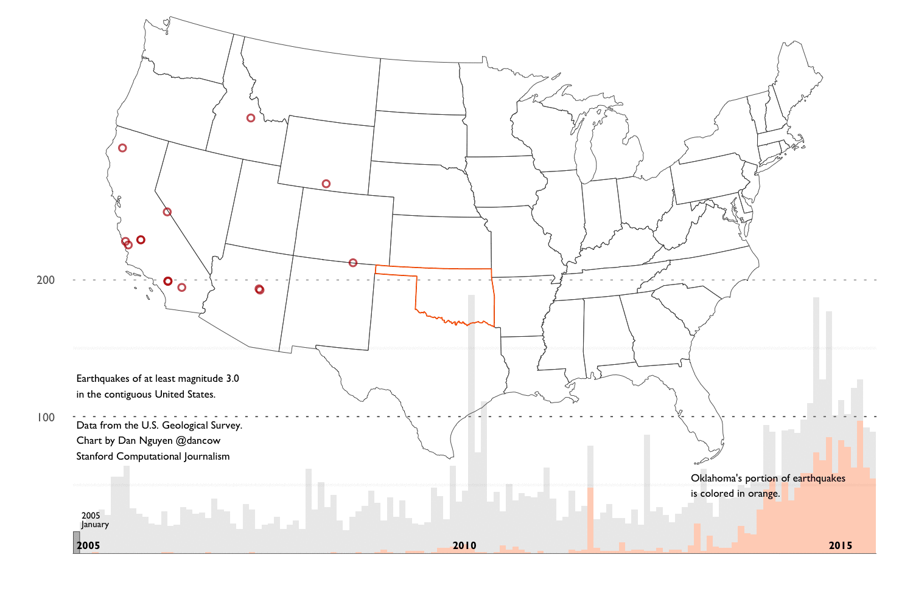

# U.S. Geological Survey Earthquake Events Archive

The U.S. Geological [Earthquake Hazards program](http://earthquake.usgs.gov/) has a searchable catalog of earthquake data -- including geospatial coordinates, date/time to the milliseconds, and magnitude. This repository packages the data in easy-to-download CSV format for analysis, including packages small enough to fit into memory/spreadsheets.

Here's an example of a multi-layered data visualization (URL TK) created using ggplot, showing the massive increase of M3.0+ earthquakes in Oklahoma in the last decade:





As an animated GIF:




# The data packages

Here is the USGS data broken down into several, easy to download packages:

- [Worldwide, 2016 (year to date)](https://helloworlddata.github.io/usgs-earthquakes/data/usgs-earthquakes-worldwide-2016.csv)
- [Worldwide, 2015](https://helloworlddata.github.io/usgs-earthquakes/data/usgs-earthquakes-worldwide-2015.csv)
- [Worldwide, 2010 through 2014](https://helloworlddata.github.io/usgs-earthquakes/data/usgs-earthquakes-worldwide-2010-through-2015.csv)
- [Worldwide, 1960 through 1999 (TK)](https://helloworlddata.github.io/usgs-earthquakes/data/usgs-earthquakes-worldwide-worldwide-decade-2000.csv)
- [The contiguous United States, from 2000 through 2015](https://helloworlddata.github.io/usgs-earthquakes/data/usgs-earthquakes-contiguous-united-states-2000-through-2015.csv)
- [The Oklahoma region, all years](https://helloworlddata.github.io/usgs-earthquakes/data/usgs-earthquakes-oklahoma-region.csv)


# The stories

In the past few years, the most prominent use of the USGS data has been to examine the sudden surge of significant earthquakes in Oklahoma, purportedly due to fracking.

Here's a vignette (URL TK) using ggplot and ggmaps showing the earthquakes by year within Oklahoma:


On September 3, 2016, [the USGS recorded a M5.6 earthquake near Pawnee](http://earthquake.usgs.gov/earthquakes/eventpage/us10006jxs#executive), Oklahoma, the state's biggest earthquake in recorded history.


<a href="http://earthquake.usgs.gov/earthquakes/eqarchives/poster/2016/20160903.php"></a>

[NPR's StateImpact project has been covering the Oklahoma earthquakes and fracking for the past few years](https://stateimpact.npr.org/oklahoma/tag/earthquakes/).


[Drilling data is spotty](http://www.occeweb.com/og/ogdatafiles2.htm), which makes it difficult to understand how activity has changed Oklahoma's underground structure. From the New Yorker longform story, [Weather Underground (April 2015)](http://www.newyorker.com/magazine/2015/04/13/weather-underground):

> “We know more about the East African Rift than we know about the faults in the basement in Oklahoma.” In seismically quiet places, such as the Midwest, which are distant from the well-known fault lines between tectonic plates, most faults are, instead, cracks within a plate, which are only discovered after an earthquake is triggered. The O.G.S.’s Austin Holland has long had plans to put together two updated fault maps, one using the available published literature on Oklahoma’s faults and another relying on data that, it was hoped, the industry would volunteer; but, to date, no updated maps have been released to the public.

Recently, researchers and scientists have attempted to show a correlation between drilling activity and Oklahoma's earthquakes. Here's a paper funded by the [Stanford Center for Induced and Triggered Seismicity](https://scits.stanford.edu/about):

__Oklahoma’s recent earthquakes and saltwater disposal__ by F. Rall Walsh III and Mark D. Zoback, June 18, 2015, _Science Advances_: [abstract](http://advances.sciencemag.org/content/1/5/e1500195) [pdf](http://advances.sciencemag.org/content/1/5/e1500195.full-text.pdf+html) [Stanford news article](http://news.stanford.edu/news/2015/june/okla-quake-drilling-061815.html)


<a href="http://advances.sciencemag.org/content/1/5/e1500195.full.pdf+html"></a>


## Data Sources

- Archive search form: http://earthquake.usgs.gov/earthquakes/search/
- USGS CSV specification: http://earthquake.usgs.gov/earthquakes/feed/v1.0/csv.php


# Development notes (i.e. about this data extraction/packaging process)

This is just me hacking around until I find proper conventions for making a hand-operated extract-transform-load system for data that is entirely based around hosting flat-files on Github (and the limitations thereof).


The [Rakefile](Rakefile) contains all the tasks needed to fetch, process, and package the data. The final products are in [data/](data/).

For example, to generate the file [data/usgs-earthquakes-decade-1970.csv](data/usgs-earthquakes-2016.csv):

```sh
# create the subdirectories, including wrangle/corral
$ rake setup

# run it with --build-all to force it to rebuild dependencies
$ rake data/usgs-earthquakes-decade-1970.csv
```

This will run a series of Python 3 scripts in [wrangle/scripts/](wrangle/scripts/), which are all one-off tasks that spit out to stdout. 

The file [data/usgs-earthquakes-decade-1970.csv](data/usgs-earthquakes-decade-1970.csv) is dependent on 120 separate data files in an __untracked__ directory named `wrangle/corral/fetched`. Running the rake task will build that directory and fetch the required data from the USGS archive:

```
└── wrangle
    └── corral
        └── fetched
            ├── 1970-01.csv
            ├── 1970-02.csv
            ├── 1970-03.csv
            ...
            ├── 1979-10.csv
            ├── 1979-11.csv
            ├── 1979-12.csv
```

Each file represents a month's worth of data, e.g. `1970-03.csv` represents the earthquake data in the [USGS archive](http://earthquake.usgs.gov/earthquakes/search/) for March 1970.

This fetching is done by [wrangle/scripts/fetch_month_from_archive.py](wrangle/scripts/fetch_month_from_archive.py), which is just a thin wrapper around this call:

http://earthquake.usgs.gov/fdsnws/event/1/query.csv?starttime=1970-03-01%2000:00:00&endtime=1970-04-01%2000:00:00&orderby=time-asc


Why does the fetching script only pull one month at a time? Because the [USGS Archive](http://earthquake.usgs.gov/earthquakes/search/) won't return more than 20,000 hits per query, and fetching by month bypasses the need to write pagination logic in the fetching script.

Why does the [data/](data/) directory contain packages of arbitrary time periods, e.g.  [data/usgs-earthquakes-2010-through-2014.csv](data/usgs-earthquakes-2010-through-2014.csv) and [data/usgs-earthquakes-decade-1980.csv](data/usgs-earthquakes-decade-1980.csv)? Because Github has a file size limit of 100MB.

There is also a soft limit for total size of a repo. For that reason, the `wrangle/corral` folder, which is where files are fetched and stored to, is not tracked.


This repo is not meant to be a direct mirror of the USGS archive, but to contain easy-to-access packages of data for educational/experimental purposes.
http://www.nytimes.com/2016/09/04/us/earthquake-ties-record-for-strongest-in-oklahoma-history.html
